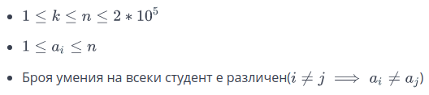

# Задача 7. Optimal Teams

За предстоящата студентска олимпиада по информатика преподавателите от ФМИ искат да формират 2 отбора. За целта те са подредили всичките n студента желаещи да участват в редица. Знаейки уменията на ***i***-тия студент в редицата капитаните Иван и Георги избират отборите по следния начин - първо Иван избира студента с най-голям брой умения както и ***k***-те студента в ляво и дясно от него(Ако в ляво или дясно има по-малко от ***k*** студенти, Иван взима в отбора колкото има). Студентите, които вече са избрани се махат от редицата. След това Георги избира по същия начин студента с най-много умения и ***k***-те студента в ляво и дясно от него. Отборите са сформирани, когато няма повече студенти в редицата. От вас се иска да намерите кои са отборите за да спестите малко време на преподавателите.

**Input Format**

* ***n*** - брой студенти
* ***k*** - брой допълнителни студенти, които ще бъдат избрани
* ***a<sub>i</sub>*** - броя умения на ***i***-тия студент

На първия ред ще получите числата ***n*** и ***k***. На втория ред ще получите числата ***a<sub>i</sub>***. Всички числа ще са разделени с един интервал.

**Constraints**



**Output Format**

На един ред изведете редицата ***t<sub>1</sub>t<sub>2</sub>...t<sub>n</sub>***, като ***t<sub>i</sub>*** е 1, ако ***i***-тия студент се намира в първия отбор и ***t<sub>i</sub>*** е 2, ако ***i***-тия студент се намира във втория отбор.

**Sample Input 0**
```
5 2
2 4 5 3 1
```

**Sample Output 0**
```
11111
```

**Sample Input 1**
```
5 1
2 1 3 5 4
```

**Sample Output 1**
```
22111
```

**Sample Input 2**
```
7 1
7 2 1 3 5 4 6
```

**Sample Output 2**
```
1121122
```

**Sample Input 3**
```
5 1
2 4 5 3 1
```

**Sample Output 3**
```
21112
```
