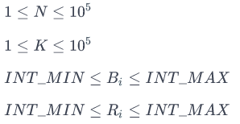

# Задача 1. Los Binares

Los Binares е най-модерният град построен през 2020 в който няма имена на улици, защото е твърде трудно да се помнят, а всеки адрес е едно единствено число. За да е по-лесно навигирането от всеки блок може да се отиде директно до най-много 2 други. За всеки един блок Q: ако има блокове с адреси по-малки от адреса на Q - те са на ляво от Q, а ако има такива с адреси по-големи от Q - те са на дясно. Тъй като всеки блок има директна връзка най-много с 2 други, няма други възможности. Не е възможно да има блокове с еднакви адреси.

Най-големият онлайн магазин Maazon иска да прави доставки в този град и иска да му напишете алгоритъм, който да изчислява колко блока трябва да посети, за да достигне целта.

На входа ще получите последователността от адреси, които са използвани за построяването на града, като ако някой се опита да построи блок с адрес, който вече съществува не трябва да се случва нищо, защото всички блокове имат уникални адреси. След което ще получите заявките от Maazon.

**Input Format**

***N***, ***K*** - ще получите последователност от N адреса по които да построите града, след което ще получите K заявки от Maazon колко е отдалечен даден адрес от началният, където е офиса на Maazon

***B<sub>1</sub> B<sub>2</sub> ... B<sub>N</sub>*** - адресите по които трябва да построите града (ако 2 адреса се повтарят е валиден само първият)

***R<sub>1</sub> R<sub>2</sub> ... R<sub>K</sub>*** - адресите на които Maazon иска да доставя, за които трябва да определите на какво разстояние са от първата построена сграда. Първата построена сграда е на разстояние 0 от себе си :)

**Constraints**



Височината на "града" няма да счупи нормален алгоритъм за решаването на задачата, тестовете са рандомизирани.

**Output Format**

**K** - на брой реда, като на ред ***i***  е разстоянието от офиса на Maazon до адреса от заявка ***R<sub>i</sub>***. Ако не съществува такъв адрес разстоянието е **-1**.

**Sample Input 0**
```
3 2
1 2 3
2 4
```

**Sample Output 0**
```
1
-1
```

**Explanation 0**

Градът ще изглежда по следния начин:
```
1 - офисът на Maazon
 \
  2
   \
    3
```

Следователно 1 е на разстояние 0. 2 е на разстояние 1. 3 е на разстояние 2. Съответно адреси, които не съществуват като 4 ще са -1.

**Sample Input 1**
```
3 3
3 5 2
3 5 0
```

**Sample Output 1**
```
0
1
-1
```

**Explanation 1**

Градът ще изглежда по следния начин:
```
  3 - офисът на Maazon
 / \
2   5
```

Следователно 3 е на разстояние 0. 2 е на разстояние 1. 5 е на разстояние 1. Съответно адреси, които не съществуват като 0 ще са -1.
