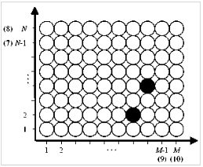
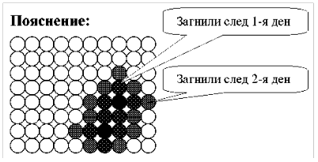

# Задача 2. Rotten from the Core



На схемата са показани ябълки, подредени в N реда и M стълба. Една или две от ябълките са гнили (черните). От допира с тях след един ден и съседните им здрави също загниват. Напишете програма, която определя колко здрави ябълки ще останат след T дни.

**Input Format**

От първия ред на стандартния вход: N, M, T. От следващите един или два реда: по 2 числа – ред и стълб, в които се намира гнила ябълка в първоначалния момент.

**Constraints**

0 < N ≤ M ≤1000 0 < T ≤ 100

**Output Format**

На един ред на стандартния изход да се изведе търсеният брой здрави ябълки.

**Sample Input 0**
```
8 10 2
4 8
2 7
```

**Sample Output 0**
```
59
```

**Explanation 0**


