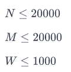

# Задача 1. Minimal forest

На входа ще получите несвързан претеглен мултиграф. Трябва да намерите тежестта на минималната покриваща гора. За всяка компонента на графа с 1 връх тази тежест е 0. За всяка компонента с повече от 1 върха тази тежест е тежестта на някое минимално покриващо дърво на компонентата.

**Input Format**

На първият ред ще получите: ***N, M***

* ***N*** е броят на върховете в графа. Върховете са номерирани с числа от ***0*** до ***N-1***.

* ***M*** е броят на ребрата.

На следващите ***M*** реда ще получите ***M*** ребра ***A B W***, където ***A*** и ***B*** са краищата на ребро, а ***W*** е тежестта му.

**Constraints**



**Output Format**

На изхода изведете едно число - тежестта на минималната покриваща гора.

**Sample Input 0**
```
3 4
0 1 1
1 0 4
0 2 7
1 2 2
```

**Sample Output 0**
```
3
```

**Explanation 0**

Всички върхове са свързани помежду си, т.е имаме 1 компонента на свързаност. За да свържем 3 върха са ни необходими 2 ребра. Най-леките ребра, които ни вършат работа са с тежест 1 и 2. 1 + 2 = 3

**Sample Input 1**
```
5 4
0 1 5
2 3 1
2 4 1
4 3 10
```

**Sample Output 1**
```
7
```

**Explanation 1**

Графът има 2 компоненти на свързаност: 0-1, 2-3-4. Минималната тежест на покриващо дърво за 0-1 е 5, а за 2-3-4 е 2. 5 + 2 = 7
