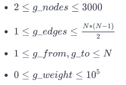

# Задача 4. Kruskal (MST): Really Special Subtree

Given an undirected weighted connected graph, find the Really Special SubTree in it. The Really Special SubTree is defined as a subgraph consisting of all the nodes in the graph and:

* There is only one exclusive path from a node to every other node.
* The subgraph is of minimum overall weight (sum of all edges) among all such subgraphs.
* No cycles are formed

To create the Really Special SubTree, always pick the edge with smallest weight. Determine if including it will create a cycle. If so, ignore the edge. If there are edges of equal weight available:

* Choose the edge that minimizes the sum ***u + v + wt*** where ***u*** and ***v*** are vertices and ***wt*** is the edge weight.
* If there is still a collision, choose any of them.

Print the overall weight of the tree formed using the rules.

For example, given the following edges:
```
u	  v	  wt
1	  2	  2
2	  3	  3
3	  1	  5
```

First choose **1->2** at weight **2**. Next choose **2->3** at weight **3**. All nodes are connected without cycles for a total weight of **3 + 2 = 5**.

**Function Description**

Complete the ***kruskals*** function in the editor below. It should return an integer that represents the total weight of the subtree formed.

***kruskals*** has the following parameters:

* *g_nodes*: an integer that represents the number of nodes in the tree
* *g_from*: an array of integers that represent beginning edge node numbers
* *g_to*: an array of integers that represent ending edge node numbers
* *g_weight*: an array of integers that represent the weights of each edge

**Input Format**

The first line has two space-separated integers ***g_nodes*** and ***g_edges***, the number of nodes and edges in the graph.

The next ***g_edges*** lines each consist of three space-separated integers ***g_from***, ***g_to*** and ***g_weight***, where ***g_from*** and ***g_to*** denote the two nodes between which the **undirected** edge exists and ***g_weight*** denotes the weight of that edge.

**Constraints**



**Note:** If there are edges between the same pair of nodes with different weights, they are to be considered as is, like multiple edges.

**Output Format**

Print a single integer denoting the total weight of the Really Special SubTree.
