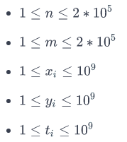
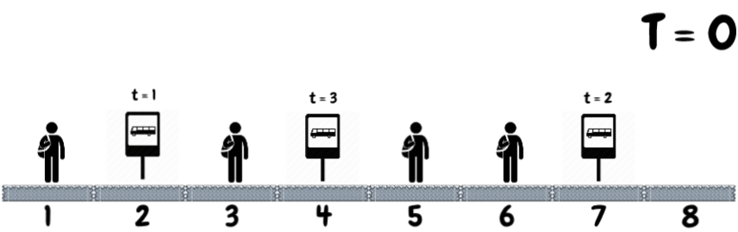
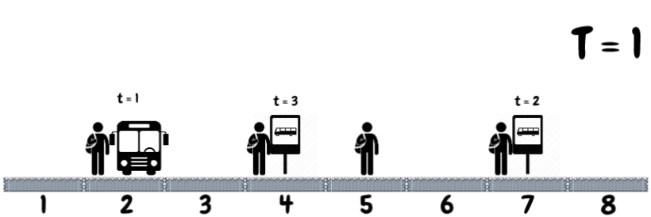
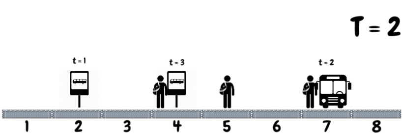
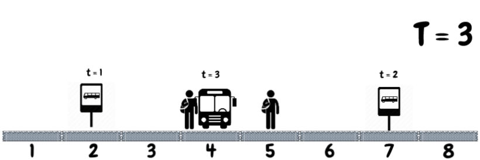
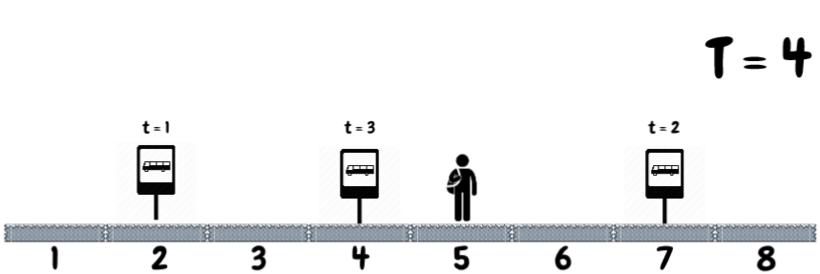

# Задача 4. Bonus: 94

[Тествайте тук](https://www.hackerrank.com/contests/practice-6-sda/challenges/94)

Студентите от СИ нямат търпение да посетят ежеседмичната лекция по СДА. Те все още са в Студентски Град и ще използват автобус 94 за да се придвижат до ФМИ. Бивайки лоши хора, асистентите са забранили да има повече от един студент в даден автобус за да се избегне подсказване за домашното. В студентски град има ***m*** спирки, като за всяка от тях знаете позицията ѝ ***y<sub>i</sub>*** , както и времето ***t<sub>i</sub>***, когато автобус 94 ще спре на нея(само един автобус 94 ще спре на дадена спирка и на всяка спирка спира различен автобус). Студентите от СИ са ***n*** на брой и за всеки от тях знаете неговата първоначална позиция ***x<sub>i</sub>***. Студентите могат да се придвижват с една единица разстояние напред и назад по маршрута за единица време. Даден студент може да хване автобус на дадена спирка, ако стигне дотам преди автобуса да е спрял(и потеглил). Ако на спирката има повече от един студент, само един от тях може да се качи.

От вас се иска да намерите колко най-много студенти ще успеят да посетят лекцията.

**Input Format**

* На първия ред са зададени числата ***n*** и ***m***
  * ***n*** - брой студенти
  * ***m*** - брой спирки
* Следват ***n*** реда, като всеки ред съответства на позиция ***x<sub>i</sub>*** на ***i***-тия студент.
* Следват ***m*** реда, като всеки ред съдържа две числа ***y<sub>i</sub>, t<sub>i</sub>*** - съответстващи на позицията на ***i***-тата спирка и времето, в което автобуса тръгва от спирката.

**Constraints**



**Output Format**

На един ред изведете максималния брой студенти, които могат да се качат на автобусите.

**Sample Input 0**
```
4 3
1
3
5
6
2 1
4 3
7 2
```

**Sample Output 0**
```
3
```

**Explanation 0**







**Sample Input 1**
```
2 2
1
10
2 10
3 2
```

**Sample Output 1**
```
2
```
