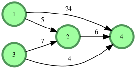

# Задача 2. Floyd : City of Blinding Lights

[Тествайте тук](https://www.hackerrank.com/contests/practice-9-sda/challenges/floyd-city-of-blinding-lights)

Given a directed weighted graph where weight indicates distance, for each query, determine the length of the shortest path between nodes. There may be many queries, so efficiency counts.

For example, your graph consists of ***5*** nodes as in the following:


A few queries are from node ***4*** to node ***3***, node ***2*** to node ***5***, and node ***5*** to node ***3***.


**Input Format**

The first line has two integers ***n*** and ***m***, the number of nodes and the number of edges in the graph.
Each of the next ***m*** lines contains three space-separated integers ***x, y***  and ***r***, the two nodes between which the *directed edge* ***x->y*** exists, and ***r***, the length of the edge.
The next line contains a single integer ***q***, the number of queries.
Each of the next ***q*** lines contains two space-separated integers ***a*** and ***b***, denoting the start and end nodes for traversal.

**Constraints**


**If there are edges between the same pair of nodes with different weights, the last one (most recent) is to be considered as the only edge between them.**

**Output Format**

Print ***q*** lines, each containing a single integer specifying the shortest distance for the query.

If the destination node is not reachable, return ***-1***.

**Sample Input**
```
4 5
1 2 5
1 4 24
2 4 6
3 4 4
3 2 7
3
1 2
3 1
1 4
```

**Sample Output**
```
5
-1
11
```

**Explanation**

The graph given in the test case is shown as:



The shortest paths for the 3 queries are:

* **1->2**: The direct Path is shortest with weight 5

* **-1**: There is no way of reaching node 1 from node 3

* **1->2->4**: The indirect path is shortest with weight (5+6) = 11 units. The direct path is longer with 24 units length.
